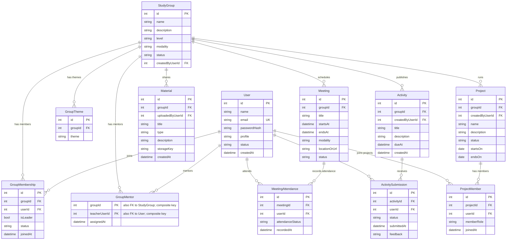

# Data Architecture & Persistence Layer

Este documento propõe um modelo relacional inicial para substituir os dados demonstrativos do wireframe. MySQL, Node.js com Express e `mysql2` com SQL manual foram escolhidos para a futura implementação; o projeto ainda não contém backend nem conexão de banco.

## Database Configuration

| Service/Module | DB Type | Profile | Driver | Connection | Migration Tool |
|---|---|---|---|---|---|
| Aplicação web atual | Nenhum | Todos | Nenhum | Não configurada | Nenhuma |
| Persistência proposta | MySQL 8.0.16+ | A definir | `mysql2` | Variáveis de ambiente e segredo externo; URL ainda não definida | MySQL Workbench para administração e execução manual do `database/schema.sql`; ferramenta de migrações versionadas ainda não definida |

Não há configuração de conexão, pool, dados iniciais ou perfis de banco no projeto. O arquivo `database/schema.sql` contém o DDL inicial; ele pode ser aberto e executado no MySQL Workbench após conectar ao servidor e selecionar um schema. O Workbench é uma ferramenta de administração e execução de SQL, não um mecanismo de migrações versionadas para a aplicação. Configure credenciais via variáveis de ambiente e segredos externos.

## Data Ownership per Service

| Service | Tables Owned | ORM Framework | Caching | Notes |
|---|---|---|---|---|
| Front-end TechFatec | Nenhuma tabela; atualmente mantém dados fictícios em memória | Nenhum | Nenhum | Os dados de demonstração estão definidos em `app.js`; o backend deve ser o proprietário das entidades propostas abaixo |
| API futura em Node.js/Express | Usuários, grupos, matrículas, orientações, encontros, presenças, materiais, atividades, entregas, projetos e participantes de projetos | Nenhum; SQL manual por `mysql2` | Nenhum configurado | Proposta para um serviço único no escopo atual; a API ainda não existe no repositório |

## Entity Model

O modelo abaixo é uma proposta lógica extraída das telas e requisitos do wireframe, não uma descrição de tabelas já existentes. Perfis ficam em `User.profile`; liderança é um atributo opcional da participação no grupo, e não uma persona separada.

<!-- mermaid-checked: every attribute is `<type> <name> [<key>] ["<description>"]` with at most one of PK/FK/UK, no \n in descriptions, no {} in descriptions, every relationship label is double-quoted -->

### Constraints and modeling notes

O DDL inicial correspondente está em `database/schema.sql` e destina-se ao MySQL 8.0.16 ou superior.

- `User.profile` deve aceitar apenas `student`, `teacher` ou `manager`. O gestor não precisa de uma entidade adicional apenas para representar a persona.
- `User.email` deve ser único e normalizado para evitar contas duplicadas.
- `GroupTheme` mantém os vários temas por grupo sem guardar uma lista serializada numa coluna.
- Aplicar unicidade em `(groupId, userId)` em `GroupMembership`, `(meetingId, userId)` em `MeetingAttendance`, `(activityId, userId)` em `ActivitySubmission` e `(projectId, userId)` em `ProjectMember`.
- `GroupMentor` usa chave composta `(groupId, teacherUserId)` e só deve associar usuários com perfil de professor.
- `GroupMembership.isLeader` representa a responsabilidade de liderança dentro do grupo. A regra de quantos líderes um grupo pode ter precisa ser definida pelo produto.
- `ActivitySubmission` permite armazenar status e feedback por estudante, em vez de manter um único status de conclusão para toda a atividade.
- `MeetingAttendance` permite calcular frequência por participante e encontro. Definir se a presença será manual, autodeclarada ou integrada a outra fonte antes de implementar.
- `Material.storageKey` representa uma chave/referência ao arquivo; o binário deve ficar em armazenamento de arquivos apropriado, não diretamente no banco.
- Para relatórios, calcular métricas a partir dos registros operacionais inicialmente. Criar tabelas de agregação ou snapshots só se houver necessidade comprovada de desempenho ou histórico.

## Key Repository Methods

Não foram encontrados repositórios no projeto atual. Os componentes abaixo são sugestões de módulos de acesso a dados para a futura API Node.js/Express com SQL manual via `mysql2`; métodos CRUD padrão foram omitidos.

| Service | Repository | Notable Methods | Purpose |
|---|---|---|---|
| API Node.js/Express | `users` data module | `findByEmail(email)` | Localizar a conta para autenticação sem expor senha em consultas de tela |
| API Node.js/Express | `groups` data module | `search(filters, sort, page)` | Listar grupos com busca, filtros e paginação da tela de exploração |
| API Node.js/Express | `group-memberships` data module | `findActiveByUserId(userId)`, `existsByGroupIdAndUserId(groupId, userId)` | Exibir grupos do estudante e impedir associação duplicada |
| API Node.js/Express | `group-mentors` data module | `findGroupIdsByTeacherUserId(userId)` | Limitar os grupos apresentados ao professor aos grupos orientados por ele |
| API Node.js/Express | `meetings` data module | `findUpcomingByGroupIds(groupIds, from)` | Consultar próximos encontros dos grupos autorizados |
| API Node.js/Express | `meeting-attendance` data module | `summarizeByGroupAndPeriod(groupId, from, to)` | Produzir indicadores de frequência a partir dos registros de presença |
| API Node.js/Express | `materials` data module | `searchByGroupIdsAndFilters(groupIds, filters, page)` | Listar materiais por grupo, tipo e termo de busca |
| API Node.js/Express | `activity-submissions` data module | `summarizeByGroupAndPeriod(groupId, from, to)` | Calcular conclusão e entregas por grupo e período |
| API Node.js/Express | `projects` data module | `findByGroupIdsAndStatus(groupIds, status)` | Exibir projetos relevantes ao estudante ou professor |
| API Node.js/Express | `project-members` data module | `findProjectIdsByUserId(userId)` | Consultar projetos dos quais o usuário participa |

Os métodos são conceituais e serão implementados com consultas SQL parametrizadas. Assinaturas, paginação, projeções e limites de autorização deverão ser definidos durante a implementação da API. Para impedir injeção de SQL, valores fornecidos pelo usuário devem ser vinculados como parâmetros, nunca concatenados à consulta.

## Caching Strategy

Não há cache configurado ou necessário para o protótipo atual. Na futura API Node.js/Express, recomenda-se começar sem cache compartilhado e medir o desempenho antes de introduzir Redis ou cache local. Dados de participação, presença, status de usuário e permissões não devem ser servidos de um cache desatualizado sem uma política explícita de invalidação.

## Data Ownership Boundaries

Atualmente, existe apenas o front-end demonstrativo e nenhum armazenamento persistente. Na proposta, uma API Node.js/Express será proprietária das entidades e gravações, usando MySQL. Não há acesso entre serviços nem CQRS; as telas de professor e gestor devem receber somente os dados permitidos ao respectivo perfil.

Estudantes relacionam-se a grupos por `GroupMembership`; professores relacionam-se a grupos orientados por `GroupMentor`. Os relatórios de presença e conclusão podem agregar `MeetingAttendance` e `ActivitySubmission` por grupo e período. Essas relações permitem montar as telas sem duplicar listas ou contadores como fonte de verdade.

### Data Classification & Sensitivity

| Entity | Sensitive Fields | Classification (PII/PHI/PCI/None) | Controls in Place |
|---|---|---|---|
| User | `name`, `email`, `passwordHash`, `profile`, `status` | PII | Não há controles no projeto atual. Na implementação, armazenar somente hash de senha com algoritmo apropriado, usar TLS, restringir acesso por perfil e proteger segredos fora do repositório |
| GroupMembership | `userId`, `isLeader`, `status` | PII indireta | Não há controles no projeto atual; consultar e modificar apenas por regras de autorização no backend |
| GroupMentor | `teacherUserId` | PII indireta | Não há controles no projeto atual; limitar dados à relação de orientação |
| MeetingAttendance | `userId`, `attendanceStatus`, `recordedAt` | PII indireta | Não há controles no projeto atual; restringir relatórios a usuários autorizados e definir retenção |
| Material | `uploadedByUserId` | PII indireta | Não há controles no projeto atual; validar autorização para acesso ao arquivo e evitar URLs públicas previsíveis |
| ActivitySubmission | `userId`, `status`, `submittedAt`, `feedback` | PII indireta | Não há controles no projeto atual; restringir entregas e feedback ao estudante e aos docentes autorizados |
| ProjectMember | `userId`, `memberRole` | PII indireta | Não há controles no projeto atual; limitar acesso à composição dos projetos conforme perfil |

Não há dados de saúde (PHI) nem dados de pagamento (PCI) identificados nos requisitos atuais. A classificação e a retenção dos dados devem ser confirmadas com as políticas da instituição antes de produção.
